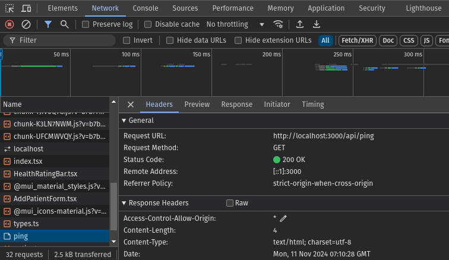
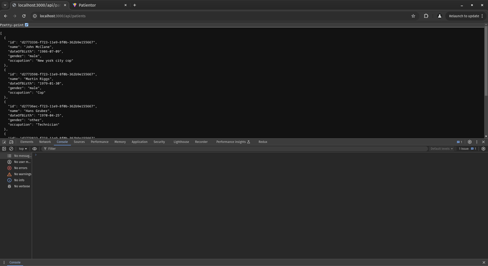
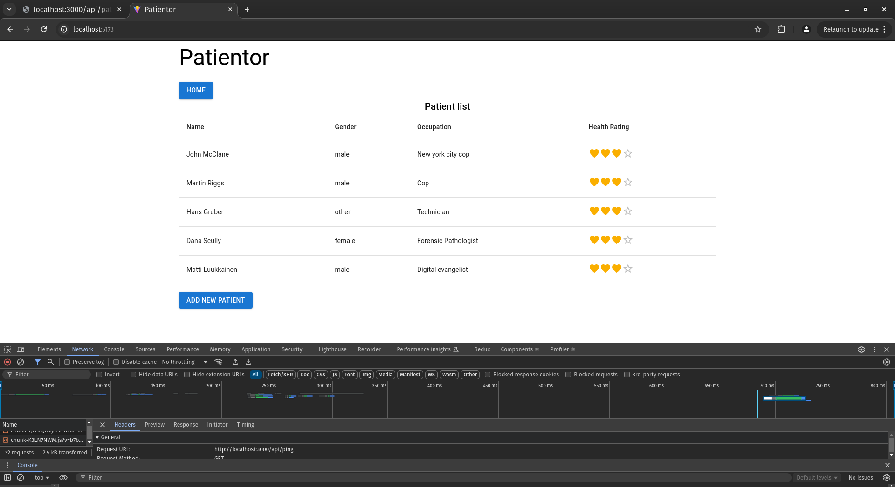

This README file serve as a document of how I solve the exercises in the Patientor project.
---

### 9.8: Patientor backend, step1
**Requirement:**
- Initialize a new backend project that will work with the frontend.
- Configure ESlint and tsconfig with the same configurations as proposed in the material.
- Define an endpoint that answers HTTP GET requests for route `/api/ping`.
- The project should be runnable with npm scripts, both in development mode and, as compiled code, in production mode.

**How I did it:**
- To initialize a new backend project, I created a folder and named it patientor-backend within the patientor folder.
- Then I ran these commands:
```bash
npm init
npm install express cors dotenv
npm install --save-dev typescript ts-node-dev eslint @eslint/js typescript-eslint @stylistic/eslint-plugin @types/express @types/eslint__js @types/cors
```
- To make the project runable with npm scripts, I created these commands in the *package.json*:
```json
"scripts": {
    "tsc": "tsc",
    "dev": "ts-node-dev index.ts",
    "start": "node /build/index.js",
    "lint": "eslint .",
    "test": "echo \"Error: no test specified\" && exit 1"
  },
```
- After that I create the config files (which include: *tsconfig.json*, *eslint.config.mjs*).
- Define an endpoint for `/api/ping`
```typescript
import express, { Request, Response } from "express";
import { PORT } from "./src/utils/config";

const app = express();
app.use(express.json());

app.get("/api/ping", (_req: Request, res: Response) => {
  res.status(200).send("pong");
});

app.listen(PORT, () => {
  console.log(`SERVER RUNNING AT http://localhost:${PORT}`);
});
```

### 9.9: Patientor backend, step2
**Requirement:**
- Fork and clone the project [patientor](https://github.com/fullstack-hy2020/patientor). Start the project with the help of the README file.
- Ensure that the backend answers ==the ping request== that the frontend has made on startup.

**How I did it:**
- Inside the patientor folder I cloned the frontend code for the project, move everything into patientor-frontend then remove .git file.
```bash
git clone git@github.com:fullstack-hy2020/patientor.git
cp -r ./patientor ./patientor-frontend && cd ./patientor-frontend
rm -rf .git
```
- Ensure the backend answer the request that the frontend has made on startup


### 9.10: Patientor backend, step3
**Requirement:**
- Create a type Diagnosis and use it to create endpoint `/api/diagnoses` for fetching all diagnoses with HTTP GET.
- Structure your code properly by using meaningfully-named directories and files.
- Note that diagnoses may or may not contain the field latin. You might want to use optional properties in the type definition.

**How I did it**
For this exercise, I created the following:
| folders/files | description                                                                                                                                                                                            |
|---------------|--------------------------------------------------------------------------------------------------------------------------------------------------------------------------------------------------------|
| /data/        | holds the data from [diagnoses.ts](https://github.com/fullstack-hy2020/misc/blob/master/diagnoses.ts) and [patients.ts](https://github.com/fullstack-hy2020/misc/blob/master/patients.ts). |
| /src/         | holds all the source code for the project.                                                                                                                                             |
| /src/routes   | holds the routing logics for the corresponding services.                                                                                                                                   |
| /src/services | holds the logics for the corresponding data handling.                                                                                                                                      |
| /src/utils    | for utility functions.                                                                                                                                                                                 |
| /src/types.ts | for types and interfaces.                                                                                                                                                                              |

First I create an interface Diagnose inside `/src/types.ts`:
```typescript
export interface Diagnose {
  code: string;
  name: string;
  latin?: string;
}
```
In the `/src/utils/utils.ts` file I created some helper functions:
```typescript
import z from "zod";
import { Diagnose } from "../types";

const DiagnoseSchema = z.object({
  code: z.string(),
  name: z.string(),
  latin: z.string().optional(),
});

export const toDiagnose = (obj: unknown): Diagnose =>
  DiagnoseSchema.parse(obj);

```

And used it in the `/data/diagnoses.ts` file:
```typescript
import { Diagnose } from "../src/types";
import { toDiagnose } from "../src/utils/utils";

const data = [
  {
    code: "M24.2",
    name: "Disorder of ligament",
    latin: "Morbositas ligamenti",
  },
  {
    code: "M51.2",
    name: "Other specified intervertebral disc displacement",
    latin: "Alia dislocatio disci intervertebralis specificata",
  },
  {
    code: "S03.5",
    name: "Sprain and strain of joints and ligaments of other and unspecified parts of head",
    latin:
      "Distorsio et/sive distensio articulationum et/sive ligamentorum partium aliarum sive non specificatarum capitis",
  },
  {
    code: "J10.1",
    name: "Influenza with other respiratory manifestations, other influenza virus codeentified",
    latin:
      "Influenza cum aliis manifestationibus respiratoriis ab agente virali codeentificato",
  },
  {
    code: "J06.9",
    name: "Acute upper respiratory infection, unspecified",
    latin: "Infectio acuta respiratoria superior non specificata",
  },
  {
    code: "Z57.1",
    name: "Occupational exposure to radiation",
  },
  {
    code: "N30.0",
    name: "Acute cystitis",
    latin: "Cystitis acuta",
  },
  {
    code: "H54.7",
    name: "Unspecified visual loss",
    latin: "Amblyopia NAS",
  },
  {
    code: "J03.0",
    name: "Streptococcal tonsillitis",
    latin: "Tonsillitis (palatina) streptococcica",
  },
  {
    code: "L60.1",
    name: "Onycholysis",
    latin: "Onycholysis",
  },
  {
    code: "Z74.3",
    name: "Need for continuous supervision",
  },
  {
    code: "L20",
    name: "Atopic dermatitis",
    latin: "Atopic dermatitis",
  },
  {
    code: "F43.2",
    name: "Adjustment disorders",
    latin: "Perturbationes adaptationis",
  },
  {
    code: "S62.5",
    name: "Fracture of thumb",
    latin: "Fractura [ossis/ossium] pollicis",
  },
  {
    code: "H35.29",
    name: "Other proliferative retinopathy",
    latin: "Alia retinopathia proliferativa",
  },
];

const diagnoseEntries: Array<Diagnose> = data.map((obj) => {
  const diagnose = toDiagnose(obj);
  return diagnose;
});

export default diagnoseEntries;

```

From there, simply wiring up the diagnoseService:
```typescript
import { Diagnose } from "../types";
import diagnoseEntries from "../../data/diagnoses";

const getDiagnoses = (): Array<Diagnose> => diagnoseEntries;

export default {
  getDiagnoses,
};
```

and diagnoseRouter:
```typescript
import express, { Request, Response } from "express";
import diagnoseService from "../services/diagnoseService";

const router = express.Router();

router.get("/", (_req: Request, res: Response) => {
  res.status(200).json(diagnoseService.getDiagnoses());
});

export default router;
```

and use it in `index.ts`:
```typescript
import //...
import diagnoseRouter from "./src/routes/diagnoses";

const app = express();

//...

app.use("/api/diagnoses", diagnoseRouter);

app.listen(/** ... */);
```


### 9.11: Patientor backend, step4
**Requirement:**
- Create data type Patient and set up the GET endpoint `/api/patients` which returns all the patients to the frontend, ==excluding field ssn==. Use a utility type to make sure you are selecting and returning only the wanted fields.
- In this exercise, you may assume that field gender has type string.
- Try the endpoint with your browser and ensure that ssn is not included in the response
- After creating the endpoint, ensure that the frontend shows the list of patients

**How I did it:**
This step is pretty much the same as 9.10. I created an interface for PatientEntry:
```typescript
// the requirement said we might assume that field gender has type string
// but I'd just create an enum for it
export enum Gender {
  Male = "male",
  Female = "female",
  Other = "other",
}

export type UUID = string;

export interface PatientEntry {
  id: UUID;
  name: string;
  dateOfBirth: string;
  ssn: string;
  gender: Gender;
  occupation: string;
}

export type NonSensitivePatientEntry = Omit<PatientEntry, "ssn">;
```

for the patientService:
```typescript
import patientEntries from "../../data/patients";
import { NonSensitivePatientEntry } from "../types";

const getPatients = (): Array<NonSensitivePatientEntry> =>
  patientEntries.map(({ id, name, dateOfBirth, gender, occupation }) => ({
    id,
    name,
    dateOfBirth,
    gender,
    occupation,
  }));

export default {
  getPatients,
};
```

then wire it up in patientRouter:
```typescript
import express, { Request, Response } from "express";
import patientService from "../services/patientService";

const router = express.Router();

router.get("/", (_req: Request, res: Response) => {
  res.status(200).json(patientService.getPatients());
});

export default router;
```

similar to diagnose endpoint, we use it like so in `index.ts`:
```typescript
import express, { Request, Response } from "express";
import cors from "cors";
import diagnoseRouter from "./src/routes/diagnoses";
import patientRouter from "./src/routes/patients";
import { PORT } from "./src/utils/config";

const app = express();

app.use(cors());
app.use(express.json());

app.get("/api/ping", (_req: Request, res: Response) => {
  res.status(200).send("pong");
});

app.use("/api/diagnoses", diagnoseRouter);
app.use("/api/patients", patientRouter);

app.listen(/** ... */);

```

With this, ssn is not included in the response:


and the frontend is able to fetch data from the server:
